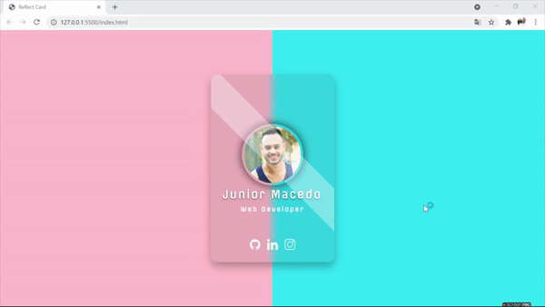

# animated-card
A shiny glass card with some animation

## Description:
A personal project to learn how to work with animations using pseudo-elements, improving glassmorphism and hover techniques.

## Techniques:

 - [x] Pseudo-element - "::" Used to style a specifield part of an element;
 - [x] Glassmorphism - To turn into a glass effect you must use box-shadow and background-color;
 - [x] Hover - Show an animation when you mouse over it;
 - [x] Transition - A specifield function to set time for animation;
 - [x] Transform - To set rotation, scale and more;

## Project:

  

## Technologies

## Check out the Web Page:
https://juniormacedo91.github.io/animated-card/

